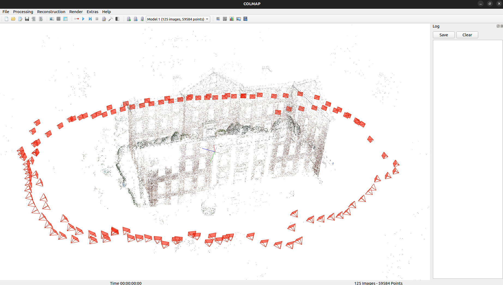

# GLOMAP: Global Structure-from-Motion Revisited

GLOMAP is a general purpose global structure-from-motion pipeline for
image-based reconstruction. GLOMAP requires a COLMAP database as input and
outputs a COLMAP sparse reconstruction. As compared to COLMAP, this project
provides a much more efficient and scalable reconstruction process, typically
1-2 orders of magnitude faster, with on-par or superior reconstruction quality.

## Getting Started
The dependency in this repo needs cmake version > 3.28. So, you have to make sure that you have correct version of cmake.
```
sudo snap install cmake --classic
```
Install the dependencies as follows:
```shell
sudo apt install ninja-build build-essential libeigen3-dev libsuitesparse-dev libblas-dev libceres-dev libboost-all-dev libflann-dev libsqlite3-dev libgl1-mesa-dev libglu1-mesa-dev freeglut3-dev libcgal-dev qtbase5-dev qtchooser qt5-qmake qtbase5-dev-tools libmetis-dev libfreeimage-dev libglew-dev
```

To build GLOMAP, first install [COLMAP](https://colmap.github.io/install.html#build-from-source)
dependencies and then build GLOMAP using the following commands: 
```shell
mkdir build
cd build
cmake .. -GNinja
ninja && sudo ninja install
```

In this section, we will use datasets from [this link](https://demuc.de/colmap/datasets) as examples.
Download the datasets and put them under `data` folder.

### From database

If a COLMAP database already exists, GLOMAP can directly use it to perform mapping:
```shell
glomap mapper \
    --database_path ./data/south-building/database.db \
    --image_path    ./data/south-building/images \
    --output_path   ./output/south-building/sparse
```
For more details on the command line interface, one can type `glomap -h` or `glomap mapper -h` for help.

We also provide a guide on improving the obtained reconstruction, which can be found [here](docs/getting_started.md)

Note:
- GLOMAP depends on two external libraries - [COLMAP](https://github.com/colmap/colmap) and [PoseLib](https://github.com/PoseLib/PoseLib).
  With the default setting, the library is built automatically by GLOMAP via `FetchContent`.
  However, if a self-installed version is preferred, one can also disable the `FETCH_COLMAP` and `FETCH_POSELIB` CMake options.
- To use `FetchContent`, the minimum required version of `cmake` is 3.28. If a self-installed version is used, `cmake` can be downgraded to 3.10.

#### Data Conversion
To convert the data using colmap, you have to install the colmap library.
```
sudo apt install colmap
```
Now, convert the data from .bin to .txt format:
```
colmap model_converter --input_path . --output_path ./output --output_type TXT
```

### From images

To obtain a reconstruction from images, the database needs to be established first. Here, we utilize the functions from COLMAP:
```shell
colmap feature_extractor \
    --image_path    ./data/south-building/images \
    --database_path ./data/south-building/database.db
colmap exhaustive_matcher \
    --database_path ./data/south-building/database.db 
glomap mapper \
    --database_path ./data/south-building/database.db \
    --image_path    ./data/south-building/images \
    --output_path   ./output/south-building/sparse
```

### Visualize and use the results

The results are written out in the COLMAP sparse reconstruction format. Please
refer to [COLMAP](https://colmap.github.io/format.html#sparse-reconstruction)
for more details.

The reconstruction can be visualized using the COLMAP GUI, for example:
```shell
cd ~/glomap/south-building
colmap gui --import_path 0/ --database_path database.db --image_path images
```
Alternatives like [rerun.io](https://rerun.io/examples/3d-reconstruction/glomap)
also enable visualization of COLMAP and GLOMAP outputs.

If you want to inspect the reconstruction programmatically, you can use
`pycolmap` in Python or link against COLMAP's C++ library interface.



### Notes

- For larger scale datasets, it is recommended to use `sequential_matcher` or
  `vocab_tree_matcher` from `COLMAP`.
```shell
colmap sequential_matcher --database_path DATABASE_PATH
colmap vocab_tree_matcher --database_path DATABASE_PATH --VocabTreeMatching.vocab_tree_path VOCAB_TREE_PATH
```
- Alternatively, one can use
  [hloc](https://github.com/cvg/Hierarchical-Localization/) for image retrieval
  and matching with learning-based descriptors.

